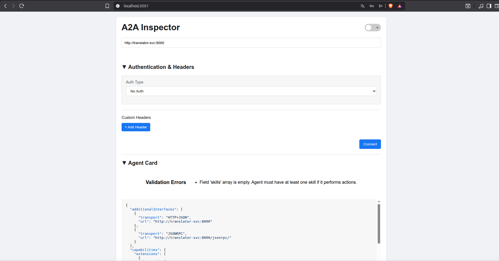

# Agent Stack: infraestructura open source para agentes IA en producción

### Guion de presentación — del protocolo A2A a los espacios de agentes

> Cada sección = 1 diapositiva. Incluye mensaje clave, contenido, notas del
> ponente y (en las demos) el comando exacto con su salida real capturada del
> laboratorio en minikube. Al final: checklist de preparación de la demo en vivo.

---

## Diapositiva 1 — Portada

**Título:** Agent Stack: infraestructura open source para desplegar agentes IA
**Subtítulo:** Seguridad, identidad y protocolo A2A — y su camino hacia los espacios de agentes
**Pie:** Laboratorio real sobre Kubernetes (minikube) · AgentStack 0.7.1 (BeeAI / Linux Foundation)

---

## Diapositiva 2 — El problema: desplegar agentes ≠ desplegar un LLM

**Mensaje clave:** un agente en producción necesita todo lo que necesita un
microservicio... más identidad, descubrimiento y gobernanza de modelos.

- Un agente no es un prompt: es un servicio con estado, credenciales y ciclo de vida.
- Necesita: identidad y auth (¿quién puede invocarme?), acceso gobernado a LLMs
  (¿con qué modelo y con qué presupuesto?), persistencia, secretos, observabilidad
  y un mecanismo estándar para que otros agentes lo encuentren y lo invoquen.
- Hacerlo artesanalmente por agente no escala → hace falta *plataforma*.

**Nota del ponente:** este es el mismo argumento que llevó de los scripts a
Kubernetes; ahora se repite con agentes.

---

## Diapositiva 3 — Qué es Agent Stack

**Mensaje clave:** plataforma open source (BeeAI, proyecto Linux Foundation) que
convierte agentes de cualquier framework en servicios A2A gestionados.

- Agnóstica de framework: cualquier agente que hable A2A es un "provider".
- Aporta de serie: registro/catálogo de agentes, proxy A2A con autenticación,
  gateway LLM multi-proveedor, UI de chat, gestión de contextos y permisos.
- Todo desplegable con Helm sobre Kubernetes.

---

## Diapositiva 4 — Arquitectura del laboratorio

**Mensaje clave:** una plataforma completa de agentes en un namespace de minikube.

```
$ kubectl get pods -n a2a
agentstack-server      Running   ← API + proxy A2A + gateway LLM
agentstack-ui          Running   ← UI web (chat con los agentes)
keycloak-0             Running   ← identidad (OIDC)
postgresql-0           Running   ← estado de la plataforma
seaweedfs-all-in-one   Running   ← almacenamiento S3 (ficheros)
otel-collector         Running   ← telemetría (OpenTelemetry)
llm-agent              Running   ┐
orchestrator           Running   ├← nuestros 3 agentes A2A
translator             Running   ┘
```

- Los agentes son Deployments+Services normales de k8s, registrados en la
  plataforma como providers con URL estable (`http://translator-svc:8000`).
- **Cada pieza de infraestructura responde a una necesidad de la diapositiva 2.**

---

## Diapositiva 5 — El protocolo A2A en una diapositiva

**Mensaje clave:** A2A (Agent2Agent, Google → Linux Foundation) estandariza cómo
los agentes se describen, se descubren y se hablan — independiente del framework.

| Concepto                 | Qué es                                                                                               | Analogía web                       |
| ------------------------ | ----------------------------------------------------------------------------------------------------- | ----------------------------------- |
| **Agent Card**     | JSON en`/.well-known/agent-card.json`: identidad, skills, transportes, seguridad                    | `robots.txt` + OpenAPI del agente |
| **message/send**   | Invocación JSON-RPC 2.0                                                                              | Petición HTTP                      |
| **message/stream** | Misma invocación, respuesta por SSE                                                                  | WebSocket/SSE                       |
| **Task**           | Unidad de trabajo con estados (`submitted → working → completed/failed`), persistente y auditable | Job con historial                   |
| **Extensiones**    | Capacidades negociables declaradas en la card (aquí: servicio LLM, API de plataforma)                | Cabeceras de negociación           |

---

## Diapositiva 6 — DEMO 1: Descubrimiento (Agent Card)

**Mensaje clave:** cualquier cliente descubre qué sabe hacer un agente sin
conocerlo de antemano — es el pilar de la interoperabilidad.

Opción navegador (sin CLI): port-forward directo al agente y abrir en Firefox:

```bash
kubectl port-forward -n a2a svc/translator-svc 8001:8000 &
# abrir: http://localhost:8001/.well-known/agent-card.json
```

Opción CLI (a través del proxy autenticado de la plataforma):

```bash
curl -s -u admin:admin123 \
  http://localhost:8333/api/v1/a2a/$PROVIDER_ID/.well-known/agent-card.json | jq .
```

Salida (recortada):

```json
{
  "name": "translator",
  "protocolVersion": "0.3.0",
  "preferredTransport": "JSONRPC",
  "capabilities": { "streaming": true, "extensions": [ ...llm, platform_api... ] }
}
```

**Nota del ponente:** señalar `protocolVersion` (el contrato), `streaming` y las
extensiones declaradas — la card es el "escaparate" del agente en el catálogo.

Opción A2a insepctor:



El **chat del inspector** llegará al agente sin las extensiones de la plataforma → responderá "No LLM model configured". Es esperado y hasta didáctico para la presentación (demuestra que las extensiones LLM son fulfillment del cliente/plataforma, no del agente). Para chat con LLM real, usa la UI de AgentStack; el inspector es tu herramienta de card + validación + JSON-RPC crudo.

---

## Diapositiva 7 — Seguridad: Keycloak + context tokens

**Mensaje clave:** la identidad no la inventa la plataforma — la delega en un
estándar (OIDC/Keycloak) y la traduce a tokens de contexto con permisos finos.

- Keycloak gestiona el realm `agentstack` con clients OIDC para cada componente:

```bash
$ curl -s -H "Authorization: Bearer $KC_TOKEN" \
    http://localhost:8336/admin/realms/agentstack/clients | jq -r '.[].clientId'
agentstack-cli
agentstack-server
agentstack-ui
```

- Para invocar agentes, la plataforma emite **context tokens** (JWT) con permisos
  por scope. Decodificado en vivo:

```json
{
  "context_id": "cb7c284f-...",
  "iss": "agentstack-server",
  "aud": ["agentstack-server"],
  "scope": { "global": { "llm": ["*"], "a2a_proxy": ["*"] } }
}
```

**Nota del ponente:** aquí está el germen del "espacio de agentes": permisos
declarativos por recurso, emitidos por una autoridad, verificables por cualquier
componente. Es lo que en un espacio de datos hacen las verifiable credentials.

---

## Diapositiva 8 — Secretos y datos

**Mensaje clave:** las credenciales nunca viven en el código ni en la imagen.

- **Kubernetes Secrets**: password de admin, claves de agentes
  (`agentstack-agents-secret`), config de SeaweedFS...
- **Postgres**: providers, contextos, tasks, historial — el estado de la
  plataforma sobrevive a reinicios.
- **API keys de los LLM** (Groq, Gemini): almacenadas cifradas por la plataforma
  (`encryptionKey` del Helm chart); los agentes jamás las ven — reciben un
  endpoint OpenAI-compatible de la plataforma con un token de contexto.

```bash
$ kubectl get secrets -n a2a | grep agentstack
agentstack-agents-secret ... agentstack-secret ...
```

**Nota del ponente:** el gateway LLM es gobernanza de modelos: un solo punto
donde auditar, limitar y facturar el uso de LLMs de todos los agentes.

---

## Diapositiva 9 — DEMO 2: Invocar un agente (message/send)

**Mensaje clave:** una invocación A2A completa: token de contexto → JSON-RPC →
Task con historial auditable.

```bash
# 1) contexto + token con permisos mínimos
CTX_ID=$(curl -s -u admin:admin123 -X POST $PLATFORM/api/v1/contexts -d '{}' \
  -H "Content-Type: application/json" | jq -r .id)
TOKEN=$(curl -s -u admin:admin123 -X POST $PLATFORM/api/v1/contexts/$CTX_ID/token \
  -H "Content-Type: application/json" \
  -d '{"grant_global_permissions":{"llm":["*"],"a2a_proxy":["*"]},
       "grant_context_permissions":{"files":["*"],"vector_stores":["*"],"context_data":["*"]}}' | jq -r .token)

# 2) message/send al translator
curl -s -X POST "$PLATFORM/api/v1/a2a/$PROVIDER_ID/" \
  -H "Authorization: Bearer $TOKEN" -H "Content-Type: application/json" \
  -d '{"jsonrpc":"2.0","method":"message/send","id":"1","params":{"message":{
    "messageId":"msg-001","role":"user",
    "parts":[{"kind":"text","text":"Good morning, my friend!"}],
    "metadata":{"https://a2a-extensions.agentstack.beeai.dev/services/llm/v1":{
      "llm_fulfillments":{"default":{
        "api_base":"{platform_url}/api/v1/openai",
        "api_key":"'$TOKEN'","api_model":"openai:llama-3.1-8b-instant"}}}}}}}' | jq .
```

Salida esencial:

```json
{ "result": { "kind": "task",
    "status": { "state": "completed" },
    "history": [ ...user..., "Buenos días, mi amigo." ] } }
```

**Nota del ponente:** la respuesta no es un texto suelto: es una **Task** con id,
estado y historial — consultable después con `tasks/get` (auditoría).

---

## Diapositiva 10 — DEMO 3 (opcional): Streaming SSE

**Mensaje clave:** el mismo protocolo soporta respuesta token a token
(`message/stream`), que es como consume la UI.

```
[event  1] status-update  state=submitted
[event  2] status-update  state=working
[event  3] status-update  state=working  chunk='Buen'
[event  4] status-update  state=working  chunk='os días'
   ...
[event  N] status-update  state=completed  final=true
```

(Comando completo en CHEATSHEET.md §7.1 — para la presentación basta la traza.)

---

## Diapositiva 11 — DEMO 4: Orquestación agente-a-agente

**Mensaje clave:** los agentes se descubren y se invocan entre sí con el mismo
protocolo que usan los humanos — no hay un "canal privilegiado".

Flujo: usuario → **orchestrator** → (descubre en el catálogo) → **translator**

```bash
# pregunta con palabra clave "translate" al orchestrator
... "text": "Please translate: The stars look wonderful tonight." ...
```

Salida:

```
🔀 Delegating to **translator** agent via A2A...
Las estrellas se ven maravillosas esta noche.
```

**Nota del ponente (lección importante):** las credenciales NO se propagan solas
entre saltos — el orchestrator debe emitir un nuevo context token para llamar al
translator. Delegación explícita por salto = trazabilidad de quién actuó en
nombre de quién. Exactamente el problema que los espacios de datos resuelven con
credenciales verificables.

---

## Diapositiva 12 — Anatomía de una petición doble: el flujo A2A al desnudo

**Mensaje clave:** una sola petición del usuario ("traduce X y además contesta Y")
se convierte en un plan y **dos delegaciones A2A** — y cada paso es un HTTP
observable. Nada de magia: plan → discover → delegate.

Agente: **orchestrator_v1** (`src/agentstack_agents/orchestrator_v1.py`), que
loguea cada GET/POST de su flujo (`A2A_TRACE=1`).

Petición de ejemplo:

```
"Translate: 'The stars look wonderful tonight'.
 Also, answer this question in one sentence: what is Kubernetes?"
```

Trace real capturado en el laboratorio (`kubectl logs deploy/orchestrator-v1 -n a2a`):

```
# 1. PLAN — un LLM descompone la petición en subtareas (gateway OpenAI de la plataforma)
[A2A trace] → POST .../api/v1/openai/chat/completions
[A2A trace] ← 200
[A2A trace] plan: translate='The stars look wonderful tonight' answer='what is Kubernetes?'

# 2. DISCOVER — catálogo de la plataforma: ¿qué agentes hay y dónde? (no es A2A: es el registry)
[A2A trace] → GET  .../api/v1/providers
[A2A trace] ← 200

# 3. CREDENCIAL — context token nuevo para los saltos (delegación explícita)
[A2A trace] → POST .../api/v1/contexts                        ← 201
[A2A trace] → POST .../api/v1/contexts/{id}/token             ← 200

# 4. DELEGATE ×2 — un message/send A2A por subtarea, vía el proxy (PEP)
[A2A trace] → POST .../api/v1/a2a/49a37b0e-...   # → translator   ← 200
[A2A trace] → POST .../api/v1/a2a/2928b061-...   # → llm_agent    ← 200
```

Respuesta al usuario (un solo Task, dos resultados combinados):

```
🔀 Delegating to **translator** agent via A2A...
Las estrellas se ven maravillosas esta noche.

🔀 Delegating to **llm_agent** agent via A2A...
Kubernetes (also known as K8s) is an open-source container orchestration system...
```

**Nota del ponente (qué es A2A y qué es plataforma):** los `message/send` del
paso 4 son protocolo A2A puro — funcionarían igual contra un agente de otro
fabricante. El planner (1), el catálogo (2) y los context tokens (3) son los
servicios del "espacio" (AgentStack); en un espacio de datos serían el
razonamiento del participante, el catálogo federado y la credencial emitida por
el trust anchor. Cada subtarea llega a su especialista con una credencial
trazable y por la puerta oficial.

---

## Diapositiva 13 — La frontera de confianza: el PEP y la puerta trasera

**Mensaje clave:** el proxy protege la puerta oficial — pero si el servicio de
detrás es alcanzable por otra vía, la política es decorativa (por ejemplo desde dentro del namespace de kubernetes).

Es el mismo patrón que gobierna un espacio de datos.

Demostrado en vivo en el laboratorio:

```bash
# Puerta oficial (proxy de la plataforma): sin credencial → rechazado
$ curl -o /dev/null -w "%{http_code}" \
    http://localhost:8333/api/v1/a2a/$PROVIDER_ID/.well-known/agent-card.json
401

# Puerta trasera (red interna del clúster): el agente responde SIN credencial
$ curl http://translator-svc:8000/.well-known/agent-card.json    # → 200
$ curl -X POST http://translator-svc:8000/jsonrpc/ -d '{...message/send...}'
# → el agente ACEPTA y procesa la task
```

La frontera de confianza real hoy es la red del namespace, no el agente.
Soluciones estándar (mejor combinadas):

1. **NetworkPolicy de Kubernetes** — solo el server puede alcanzar a los agentes:

```yaml
kind: NetworkPolicy
spec:
  podSelector: { matchLabels: { app: translator } }
  ingress:
    - from:
        - podSelector: { matchLabels: { app: agentstack-server } }
```

2. **Autenticación en el propio agente** — y A2A ya lo contempla: la Agent Card
   declara `securitySchemes` (cómo autenticarse contra el agente) y existe la
   *authenticated extended card*: card pública mínima para el descubrimiento,
   card extendida —con los skills sensibles— solo tras autenticarse.

**Nota del ponente (traducción a espacios de datos):** el catálogo (metadatos)
puede ser más público que el acceso al activo — dónde pones esa línea es una
**política del espacio**, no una limitación técnica. En un FDSC, APISIX protege
la puerta y la red interna protege el context broker; aquí el proxy A2A protege
la puerta y las NetworkPolicies deben proteger a los agentes.

---

## Diapositiva 14 — De espacios de datos a espacios de agentes

**Mensaje clave:** la arquitectura de un espacio de datos se traslada casi 1:1;
lo que cambia es el activo: de datos a capacidades (agentes).

| Espacio de datos (FIWARE/IDSA)     | Espacio de agentes (este laboratorio)                    |
| ---------------------------------- | -------------------------------------------------------- |
| Context Broker / servicio de datos | AgentStack server + agentes A2A                          |
| Entidades NGSI-LD / datasets       | Agentes y sus*skills*                                  |
| Smart Data Models                  | **Agent Cards** (`/.well-known/agent-card.json`) |
| Catálogo federado                 | Registro de providers (`/api/v1/providers`)            |
| APISIX como PEP                    | (siguiente fase: gateway delante del proxy A2A)          |
| Verifiable Credentials + ODRL      | Context tokens JWT con permisos por scope (hoy)          |
| Contratación TMForum              | (futuro: ofertar agentes como productos)                 |

**Nota del ponente:** el conector FIWARE es agnóstico al payload: protege HTTP,
y A2A **es** HTTP. La única pieza realmente nueva son las políticas por skill.

---

## Diapositiva 15 — Estándares y hoja de ruta

**Mensaje clave:** no es una idea aislada — los organismos de los espacios de
datos ya están incorporando agentes.

- **A2A**: protocolo abierto bajo la Linux Foundation (como AgentStack).
- **IDSA Rulebook 2026-1**: primer capítulo dedicado a agentes IA como actores
  en espacios de datos.
- **Academia**: "From Data Spaces to Agent Spaces" (Polleres et al., SDS 2026).

Hoja de ruta del laboratorio:

1. **APISIX como PEP** delante del proxy A2A (agentes como URLs ofertadas). ✔️ arquitectura validada
2. **Políticas por skill** (ODRL/OPA sobre el body JSON-RPC).
3. **Identidad federada** (OIDC4VP + verifiable credentials; Keycloak como emisor).
4. **Marketplace**: agentes como product offerings (TMForum).

---

## Diapositiva 16 — Lecciones aprendidas y conclusiones

**Mensaje clave:** el valor de un laboratorio real: los problemas que no salen
en los tutoriales.

- La identidad importa en cada salto: el fulfillment de extensiones no se
  propaga entre agentes → cada hop necesita su propio token (¡y eso es bueno!).
- El registro de agentes necesita ubicaciones estables (Service DNS, no pod IP)
  — el equivalente a los identificadores persistentes de un catálogo de datos.
- Infra madura ≠ infra perfecta: catálogo de modelos que no sobrevive a
  reinicios (bug 0.7.1), workarounds de Keycloak... todo documentado y automatizado.

**Cierre:** AgentStack demuestra que la infraestructura para agentes ya es
desplegable hoy con piezas estándar (k8s, OIDC, Postgres) y protocolos abiertos
(A2A). El siguiente paso natural es envolverla con la capa de confianza de los
espacios de datos → un **espacio de agentes**.

---

# Anexo: checklist de preparación de la demo en vivo

```bash
# 1. Port-forwards (server, UI, keycloak, agente directo para la card)
kubectl port-forward svc/agentstack-server-svc 8333:8333 -n a2a &
kubectl port-forward svc/agentstack-ui-svc     8334:8334 -n a2a &
kubectl port-forward svc/keycloak              8336:8336 -n a2a &
kubectl port-forward svc/translator-svc        8001:8000 -n a2a &

# 2. Si el server se reinició desde la última vez: repoblar catálogo de modelos
bash deploy/k8s/platform/recreate-model-provider.sh

# 3. Verificar que los 4 agentes están online (llm_agent, translator, orchestrator, orchestrator_v1)
curl -s -u admin:admin123 http://localhost:8333/api/v1/providers | \
  jq -r '.items[] | "\(.state)\t\(.agent_card.name)"'

# 4. Ensayo completo del protocolo (todas las fases en un comando)
uv run python examples/test_a2a_protocol.py

# 5. Para la diapo 12 (petición doble): trace en vivo del orchestrator_v1
kubectl logs -f deploy/orchestrator-v1 -n a2a | grep "A2A trace"
```

Visores de Agent Card sin CLI:

- **Navegador**: `http://localhost:8001/.well-known/agent-card.json` (Firefox
  formatea el JSON automáticamente; sin autenticación gracias al port-forward
  directo al agente).
- **A2A Inspector** (herramienta oficial del proyecto A2A): UI web con card,
  validación de conformidad con el spec, chat y consola JSON-RPC. Desplegado
  en el propio clúster (namespace `a2a`, manifiesto en
  `../agent_inspector/k8s/a2a-inspector.yaml`):

  ```bash
  kubectl port-forward -n a2a svc/a2a-inspector-svc 8090:8080 &
  # abrir http://localhost:8090 y conectar a:  http://translator-svc:8000
  # (DNS interno del clúster — el inspector corre dentro, sin auth)
  ```
  Nota: el chat del inspector llega al agente sin las extensiones de la
  plataforma, así que el agente responderá "No LLM model configured" — para
  chat usar la UI de AgentStack; el inspector brilla para card + validación
  de spec + ver el JSON-RPC crudo.
